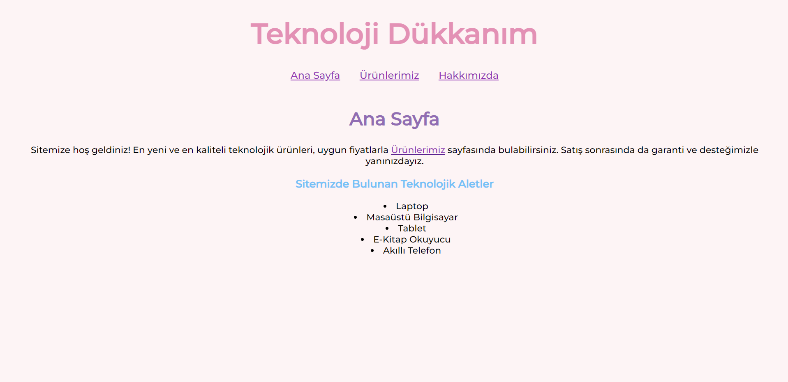

# CSS - First Homework
This is the first assignment of the CSS course on [Patika.dev](https://patika.dev). After covering the basics of CSS, we were asked to create a simple multi-page website by applying these concepts. Here, I put into practice the new concepts I learned, such as inline CSS, external CSS, and classes.

Here is a screenshot of a page for example:
